# Accessing secrets in Azure Key Vault from ASP.NET Core

## Introduction

Key Vault is the recommended service for securely storing application secrets in Azure. ASP.NET Core allows application configuration values to seamlessly integrate with Key Vault.

In this lab, you will create an ASP.NET Core 2.0 application that securely accesses a SQL Database connection string from Key Vault. You will deploy the application to Azure App Service. You will also learn how to run the application locally with Key Vault integration.


## Prerequisites

To complete this lab, you will need:

* Visual Studio 2017 update 5
* An active Microsoft Azure account


## Exercises

This workshop consists of the following exercises:

* [Create an ASP.NET Core 2.0 application with SQL Server LocalDB](#Exercise1)
* [Publish the application to Azure](#Exercise2)
* [Store the Azure SQL Database connection string in Key Vault](#Exercise3)
* [Develop locally using Key Vault](#Exercise4)
* [Clean up Azure resources](#Exercise5)


<a name="Exercise1"></a>

## Create an ASP.NET Core 2.0 application with SQL Server LocalDB

In this exercise, you will create an ASP.NET Core web application that interacts with SQL Server LocalDB to manage user accounts. This application is used in the remaining exercises to demonstrate how to integrate with Azure Key Vault.

### 1. Create ASP.NET Core project

In Visual Studio 2017, create a new **ASP.NET Core Web Application** project.

In the **New ASP.NET Core Web Application** dialog, select **ASP.NET Core 2.0** from the dropdowns and then select **Web Application**.

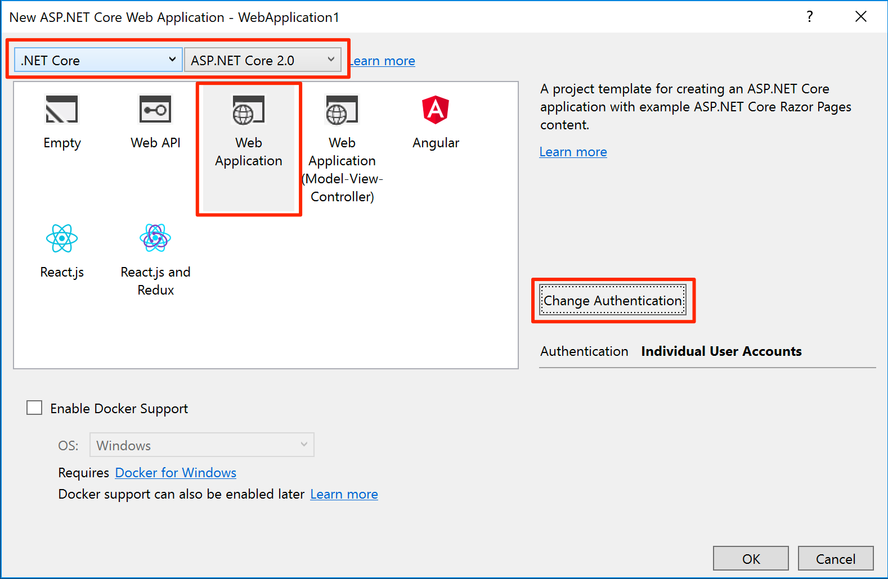

Change authentication to **Individual User Accounts**. Then select **Store user accounts in-app**.

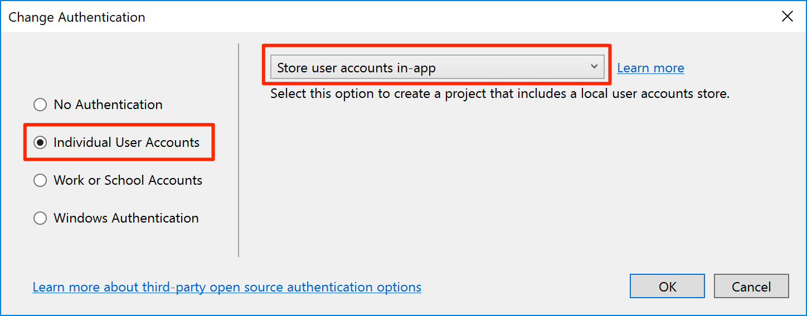

A project with individual account authentication is created. Open **appsettings.json** and see that the `DefaultConnection` connection string is set to a SQL Server LocalDB instance. Because the LocalDB connection string is not considered a secret, it is acceptable to store it in appsettings.json and commit it to source control.

### 2. Enable automatic database migrations

In **Startup.cs**, add an `ApplicationDbContext` parameter to the `Configure()` method. Then add the following line of code to automatically apply database migrations on application startup.

```csharp
public void Configure(IApplicationBuilder app, IHostingEnvironment env, ApplicationDbContext dbContext)
{
    dbContext.Database.Migrate();
    
    // ...
}
```

>  In a real-world application, you may want to apply migrations manually.

### 3. Test the application

Run the application and register a new user.

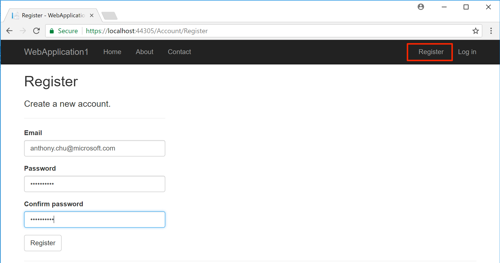

The user is created in the SQL Server LocalDB instance.


<a name="Exercise2"></a>

## Publish the application to Azure

In this exercise, you will create a Web App and a SQL Database in Azure, and deploy the application.

### 1. Publish the application from Visual Studio

In **Solution Explorer**, right-click on the project and select **Publish** to open the publish dialog.

Select **Azure App Service** and **Create New**.

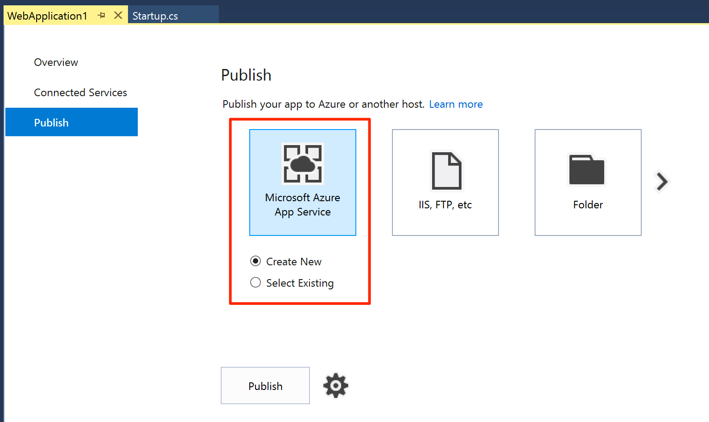

Click **Publish** to open the **Create App Service** dialog.

Log in to your Azure account and fill out the form:

* **App Name** - Enter a unique application name.
* **Subscription** - Select the subscription to deploy the application to.
* **Resource Group** - Click **New** and enter a unique resource group name.
* **App Service Plan** - Click **New** and create an App Service Plan with a unique name. Select a location (**East US**) and a size (**Free**).

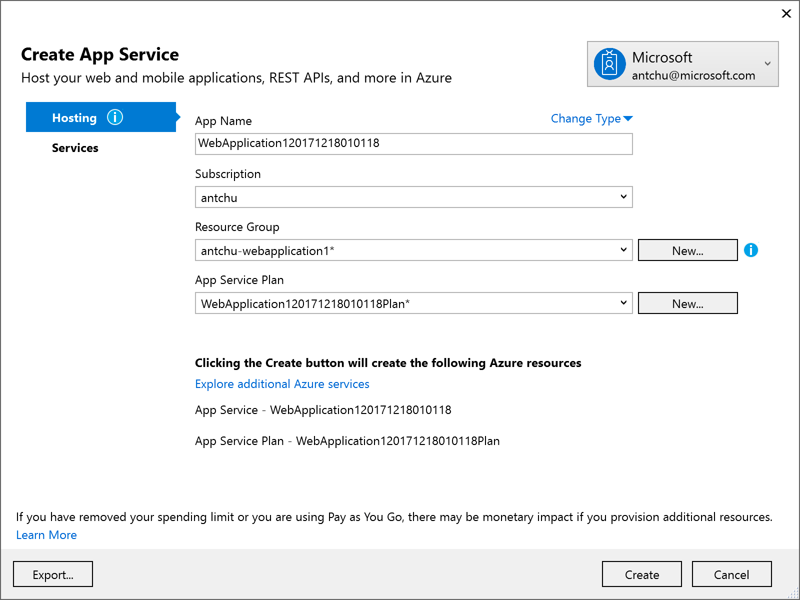

Select the **Services** tab and add a SQL Database resource.

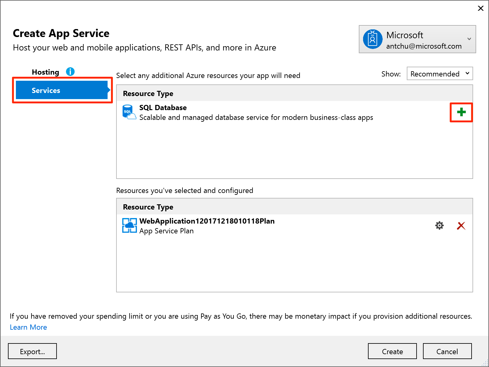

Select a new database server. Ensure the connection string name is `DefaultConnection`.

Create the three resources: App Service Plan, SQL Server, and SQL Database.


### 2. Test the application

When the resources are provisioned in Azure and the application is published, the application opens in a browser window.

Register a new user. A new user is created in the Azure SQL Database.


<a name="Exercise3"></a>

## Store the Azure SQL Database connection string in Key Vault

The application currently deployed in Azure uses application settings to store the database connection string secret; anyone who has access to the Web App can also see the secret.

In this exercise, you will update the application to read the secret from Azure Key Vault. Key Vault allows fine-grained control over which identity principals can access secrets and which actions can be performed.

### 1. Enable Managed Service Identity

In the Azure portal, open the Web App that you created. Select **Managed service identity** and enable it.

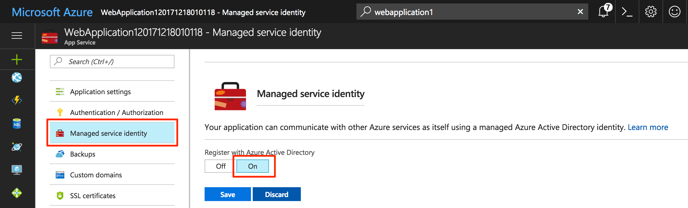

### 2. Create a Key Vault

In the Azure portal, create a new Key Vault in the same location and resource group as the Web App and SQL Database.

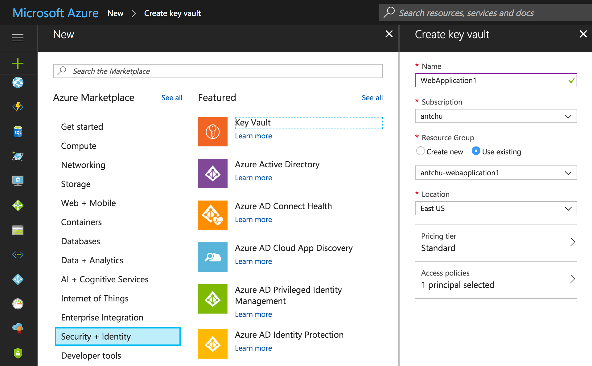

In the **Create Key Vault** window, select **Access policies**.

By default, your user already has access to manage items in the Key Vault.

Add a new access policy to give the Web App **Get** and **List** secrets permission to the Key Vault.

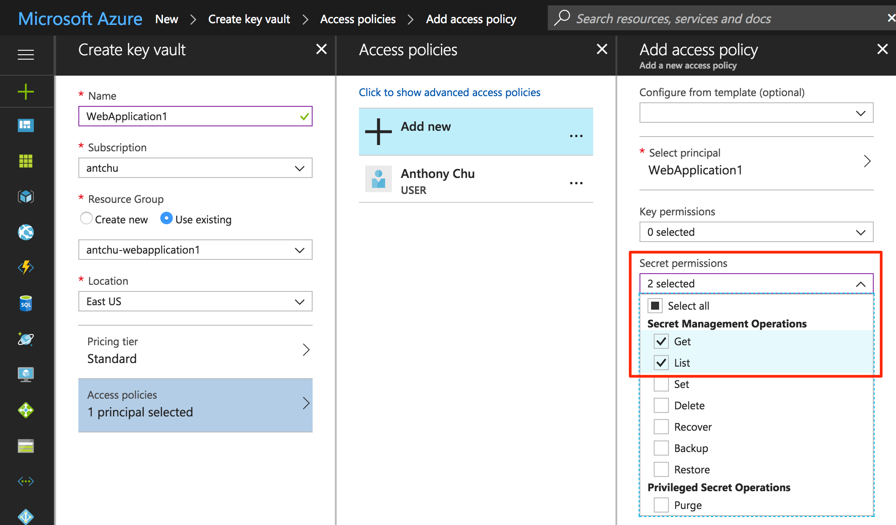

Create the Key Vault.

### 3. Use Key Vault to store connection string secret

Open the Web App in the Azure portal and select **Application settings**. Copy the value of the connection string named `DefaultConnection`.

> This connection string value was created by the Visual Studio App Service publishing process.

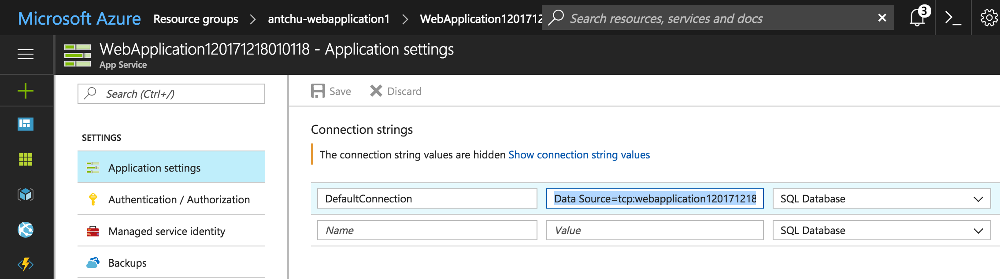

Open the Key Vault in the Azure portal.

Select **Secrets** and add a new **Manual** secret named `ConnectionStrings--DefaultConnection`. Use the value copied from the application settings.

> The `--` notation specifies nested configuration values. `DefaultConnection` is a nested property of `ConnectionStrings`.

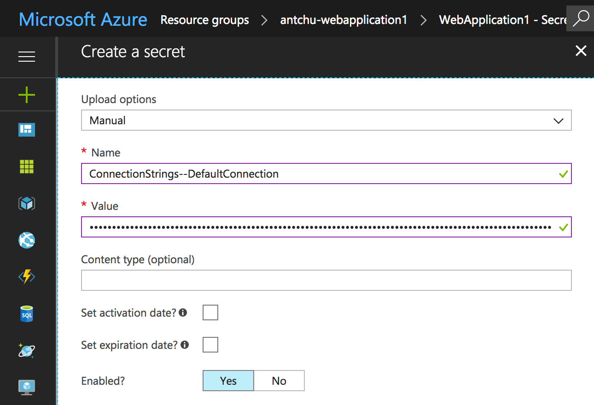

Now that the secret has been created, copy the Key Vault's DNS name from its overview page.

Open the Web App's application settings again in the Azure portal:

* Add an application setting named `KEYVAULT_ENDPOINT` and paste in the Key Vault's DNS name as the value.
* Delete the `DefaultConnection` connection string.

In Visual Studio, right-click on the project and select **Manage NuGet Packages**. Search for the `Microsoft.Azure.Services.AppAuthentication` package (include prerelease) and install it. 

Open **Program.cs** and modify the `BuildWebHost()` method to also read configuration from Key Vault:

```csharp
using Microsoft.Azure.KeyVault;
using Microsoft.Azure.Services.AppAuthentication;
using Microsoft.Extensions.Configuration;
using Microsoft.Extensions.Configuration.AzureKeyVault;

// ...

public static IWebHost BuildWebHost(string[] args) =>
    WebHost.CreateDefaultBuilder(args)
        .ConfigureAppConfiguration((ctx, builder) =>
        {
            var keyVaultEndpoint = builder.Build()["KEYVAULT_ENDPOINT"];
            if (!string.IsNullOrEmpty(keyVaultEndpoint))
            {
                var azureServiceTokenProvider = new AzureServiceTokenProvider();
                var keyVaultClient = new KeyVaultClient(
                    new KeyVaultClient.AuthenticationCallback(
                        azureServiceTokenProvider.KeyVaultTokenCallback));
                builder.AddAzureKeyVault(
                    keyVaultEndpoint, keyVaultClient, new DefaultKeyVaultSecretManager());
            }
        })
        .UseStartup<Startup>()
        .Build();
```

Publish the application to Azure. The application should still be functional.

> Because `AddAzureKeyVault()` is called after other configurations sources ,such as appsettings.json, are added to the builder by `CreateDefaultBuilder()`, any configuration values in Key Vault will override existing configuration values with the same keys.


<a name="Exercise4"></a>

## Develop locally using Key Vault

There are some situations where it is preferred to work locally with a remote SQL Database in Azure rather than SQL Server LocalDB. Using a Visual Studio extension, the `Microsoft.Azure.Services.AppAuthentication` library used in the application can securely access a Key Vault in Azure while debugging a local application.

### 1. Install and configure Azure Services Authentication Visual Studio extension

Install the [Azure Service Authentication extension](https://marketplace.visualstudio.com/items?itemName=chrismann.MicrosoftVisualStudioAsalExtension) in Visual Studio. It allows projects that use the `Microsoft.Azure.Services.AppAuthentication` library to access Azure resources such as Key Vault using your Visual Studio account.

Configure the extension by selecting your account in the Azure Service Authentication options.

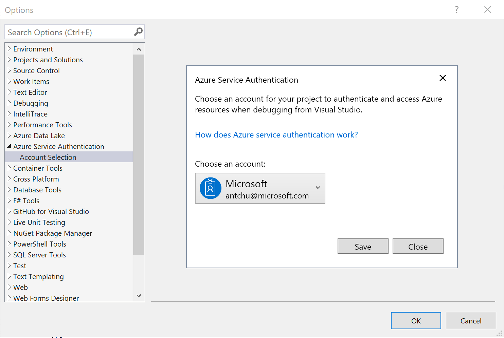

> By default, when the Key Vault was created, your account was given permissions to read and managed secrets. Using this Visual Studio extension, the application accesses Azure Key Vault using your selected Azure Active Directory identity.

### 2. Configure local application to use Key Vault

The application checks for the presence of a `KEYVAULT_ENDPOINT` configuration value to determine if Key Vault is used. Add this value to the application's configuration to enable Key Vault in the application.

Because the Key Vault DNS name is potentially sensitive information, it should not be added to appsettings.json and committed to source control.

.NET Core can store user secrets in the local system without adding them to the project. To modify local user secrets, right-click the project in Visual Studio and select **Manage User Secrets** to open a secrets.json file.

Add an entry for the `KEYVAULT_ENDPOINT` setting.

```json
{
  "KEYVAULT_ENDPOINT": "https://<keyvault-name>.vault.azure.net/"
}
```

### 3. Configure SQL Database for remote access

Azure SQL Database blocks all incoming connections except for IP addresses specified in a whitelist. To allow the application to access the database in Azure, add a firewall rule to the SQL Database Server using the Azure portal.

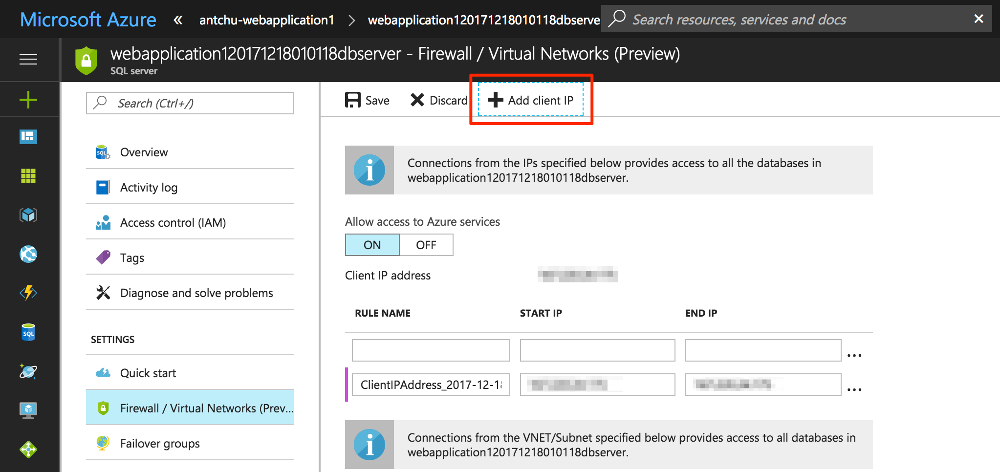

### 4. Test the application

In Visual Studio, set a breakpoint in `ConfigureServices()` in **Startup.cs** to inspect the value of `Configuration.GetConnectionString("DefaultConnection")`. Run the application to see it is now using the connection string from Key Vault.

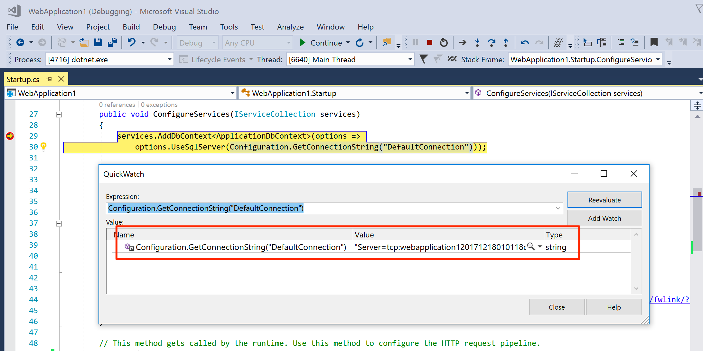


<a name="Exercise5"></a>

## Clean up Azure resources

When you are done with the resources created in this lab, it is safe to delete the resource group using the Azure portal.

